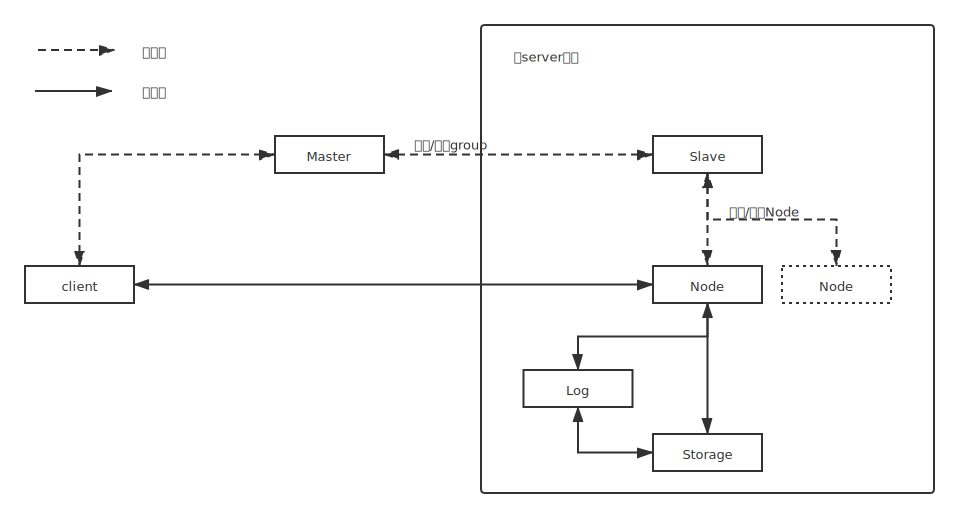

# 说明

非拜占庭节点的分布式共识算法Raft的python实现。

Raft官网：https://raft.github.io/

## raft
### 整体架构

### 文件说明

- node.py, log.py为raft核心代码
- node.py 实现raft的节点消息收发、角色转换等功能
- log.py 实现具体的日志存储
- rpc.py 实现具体消息编码和转发
- master.py 控制面中心节点, 进行group创建和管理
- slave.py 每个server上部署的控制面节点

## test
环境：windows 10系统 单机

### 测试步骤
1. 运行 python -m raft.master, 启动master节点
2. 运行 python -m raft.slave, 启动slave节点
3. 运行 python -m test.test_master **param**
    - param: create_group, create一个raft group
    - param: stop_group, 安全终止 一个raft group
    - param: stop_master, 安全终止master
4. 运行 python -m test.test_slave **param**
    - param: stop_slave, 安全终止slave
5. 运行 python -m test.client, 用户写入log

## 结果说明
- data/master, master存储的数据
- data/slvae, slave存储的数据
- data/node 
    - .log 各node交互过程监控数据, 可以在git bash中用tail -f filename.log查看
    - persistent.json, node持久化数据
    - log.json, 存储的日志
